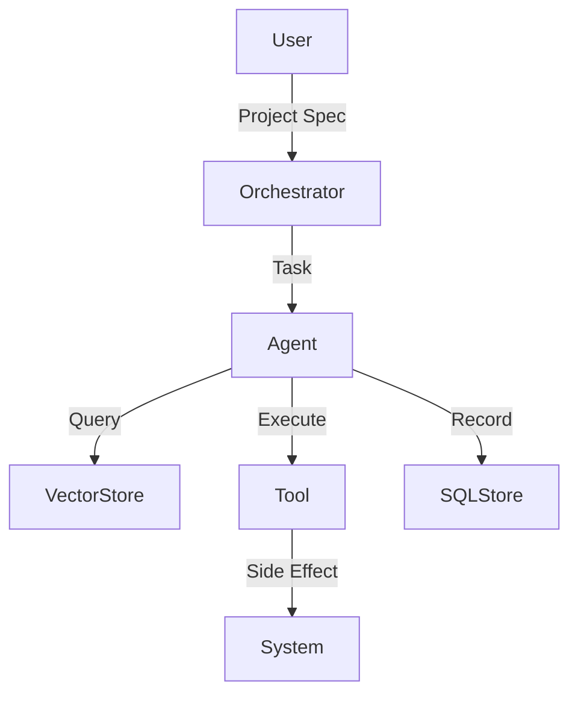

# Architecture

## Overview

The system is designed as a centralized orchestrator managing a swarm of financial and creative agents.

### Components

1.  **Orchestrator Core**: The brain. It receives tasks, decomposes them, and routes them to agents. Uses a provider-agnostic LLM interface.
2.  **Agents**: Stateless entities that combine a role (System Prompt), a set of Tools, and access to Memory. They interact with LLMs via the `BaseLLMProvider`.
3.  **LLM Providers**:
    *   **GroqProvider**: Default provider using Groq's high-speed inference (OpenAI-compatible).
4.  **Voice & Barge-In**:
    *   **VoiceRouter**: Manages WebSocket sessions and routes audio.
    *   **VoiceSession**: Implements a state machine (IDLE -> LISTENING -> THINKING -> SPEAKING).
    *   **Barge-In Logic**: While SPEAKING, if user audio energy > threshold, the current TTS task is cancelled, output queue is cleared, and new input is processed immediately.
    *   **Adapters**: Pluggable `STTAdapter` and `TTSAdapter` interfaces.

### Data Flow (Text)

1.  User submits a `ProjectSpec`.
2.  Orchestrator creates a `TaskSpec`.
3.  Orchestrator routes the task to an `Agent`.
4.  Agent retrieves context from `VectorStore`.
5.  Agent calls LLM to generate a plan.
6.  Agent executes `Tools` based on the plan.
7.  Results are stored in `SQLStore` and returned.

### Data Flow (Voice)

1.  Client connects to `/ws/voice`.
2.  Client streams `audio_chunk` events.
3.  Server accumulates audio -> triggers VAD.
4.  Server calls STT -> Text.
5.  Server calls LLM -> Response Text.
6.  Server calls TTS -> Audio Stream.
7.  Server streams audio chunks back to Client.
8.  **Barge-In**: If Client sends audio during step 7, Server cancels step 7 and jumps to step 3.

### Diagram

