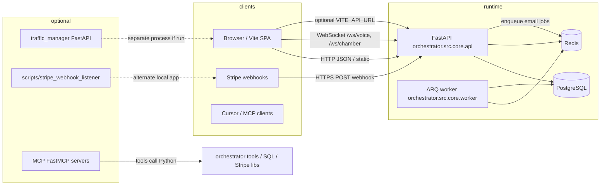

# Services and interactions

High-level map of **runnable components** in this repository and how they connect. Scope is the **canonical** tree at repo root (`orchestrator/`, `frontend/`, `scripts/`, `mcp_internal/`, `infra/`, `data/`). Duplicate trees under `core_secondary/` and `data/core_secondary/` are mirrors/copies, not additional runtime tiers.

---

## Diagram (logical)

---

## Backend API (orchestrator)

| Piece | Role | Tech |
|-------|------|------|
| **`orchestrator/src/core/api.py`** | Main HTTP API: health, catalog, blog, affiliates, analytics, Stripe webhook, static mounts | FastAPI, Starlette |
| **`orchestrator/src/core/orchestrator.py`** | Agent matrix: LLM (Groq), tools, vector memory, SQL store, scheduler, ARQ pool, campaigns | Python asyncio, APScheduler, arq |
| **`orchestrator/src/core/worker.py`** | ARQ worker: `send_email_campaign_item` for outreach emails | arq, Redis |
| **`orchestrator/src/core/outreach/`** | SMTP config, campaign templates, orchestration hooks | Python |
| **`orchestrator/src/memory/sql_store.py`** | SQLite/Postgres persistence: analytics, profit ledger, etc. | SQLAlchemy |
| **`orchestrator/src/core/database.py`** | Async SQLAlchemy session for ORM models (e.g. affiliates) | asyncpg / SQLite |
| **`orchestrator/src/core/monetization/engine.py`** | Funnel stages, recommendations, catalog logic | Python |
| **`orchestrator/src/core/voice/`** | Voice session loop (STT/TTS adapters); **WebSocket wiring incomplete** vs tests | asyncio |

**Interactions**

- **Frontend** → HTTP to `BACKEND_URL` / `VITE_API_URL` (Groq/Stripe keys stay server-side).
- **Stripe** → POST webhook to `/api/v1/monetization/webhook`.
- **Orchestrator** → **Redis** for ARQ job queue; **Postgres** (or SQLite in dev) for ORM and `SQLStore` depending on config.
- **Docker Compose** (`infra/docker/docker-compose.yml`) runs **orchestrator**, **worker**, **db**, **redis**, **adminer** with shared env (`POSTGRES_URL`, `REDIS_URL`, `GROQ_API_KEY`, …).

---

## Frontend (`frontend/`)

| Piece | Role | Tech |
|-------|------|------|
| **Vite + React Router** | SPA: marketing, pricing, blog, dashboard-style pages | React, `react-router-dom` |
| **`frontend/src/config.js`** | Default API base URL constant | JS |
| **Pages** | Call backend for products, health, blog, telemetry, **and some unimplemented routes** (see `api-endpoints.md`) | `fetch` |

**Interactions**

- Talks to **FastAPI** for data and operations.
- **No Node API** in-repo for `/api/*` — all “real” APIs are expected from the Python backend unless you add a BFF.

---

## Workers

| Worker | Entry | Trigger | Does |
|--------|-------|---------|------|
| **ARQ email worker** | `arq worker orchestrator.src.core.worker.WorkerSettings` (see Dockerfile.worker) | Jobs enqueued on Redis (from orchestrator outreach path) | Sends campaign email via `SMTPOutreachTool`, logs analytics on failure |

---

## Scripts (`scripts/`)

Large **automation / verification / monetization** library. Categories:

| Category | Examples | Interacts with |
|----------|----------|----------------|
| **Server** | `run_server.py` | Starts uvicorn on `api:app` |
| **Stripe / monetization** | `stripe_webhook_listener.py`, `verify_*payment*`, `create_new_stripe_products.py` | Stripe API, local HTTP |
| **Content / SEO** | `populate_amazing_blog.py`, `generate_seo_metadata.py` | `data/`, `docs/` |
| **Daemons / swarms** | `*daemon*.py`, `*swarm*.py`, `autonomous_*` | External sites, SMTP, APIs |
| **Integrity** | `test_system_integrity.py`, `matrix_*`, `audit_api_vanguards.py` | Repo + optional live services |
| **Data migration** | `migrate_json_to_postgres.py` | DB |

Scripts generally **invoke orchestrator modules** or external APIs directly; they are not part of the default Docker **orchestrator** HTTP process unless you run them separately.

---

## MCP internal servers (`mcp_internal/servers/`)

| Server | Purpose |
|--------|---------|
| **stripe** | Monetization tools (payment links, funnels, yield, niche landers, affiliates, tiers) wrapping `orchestrator.src.tools.revenue_tools` |
| **outreach** | Outreach-related MCP tools |
| **oracle** | Advisory / oracle-style tools |
| **swarm** | Swarm coordination tools |

**Interactions:** MCP host (e.g. Cursor) starts subprocess; tools run **in-process Python** against the same codebase — not the same as the browser hitting port 8000.

---

## Infra

| Asset | Purpose |
|-------|---------|
| **`infra/docker/docker-compose.yml`** | Orchestrator + worker + Postgres + Redis + Adminer |
| **`infra/docker/Dockerfile.orchestrator`**, **`Dockerfile.worker`** | Container images for API and worker |
| **`infra/cli/`** | Small Node CLI package (separate from Vite frontend) |

---

## Data directory (`data/`)

Runtime and content: `catalog/`, `blog/`, `assets/`, `marketing/`, `generated/swarms/`, etc. **Read/written** by API handlers, agents, and scripts. Not a separate service — shared filesystem state for the backend and jobs.

---

## Duplicate trees (`core_secondary/`, `data/core_secondary/`)

Older or synced copies of the same patterns. **Do not** double-count as distinct microservices; prefer the root `orchestrator/` and `frontend/` for architecture truth.
